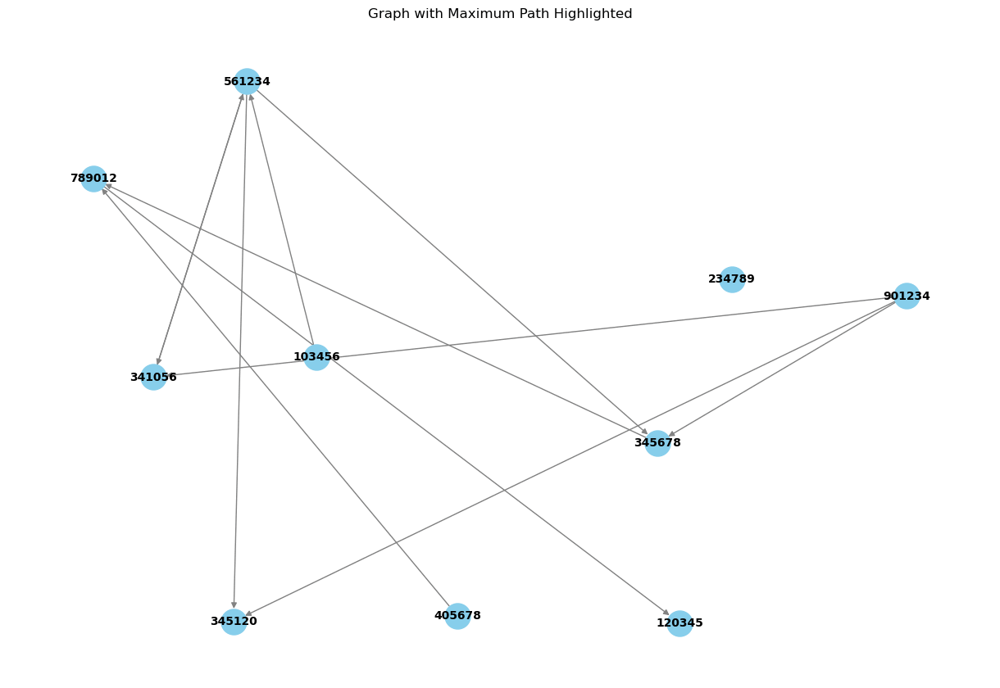
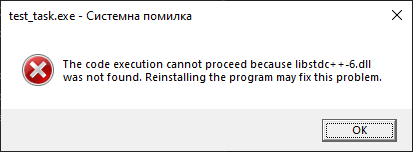
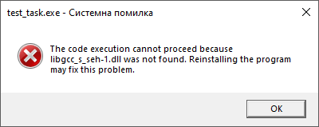
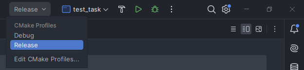
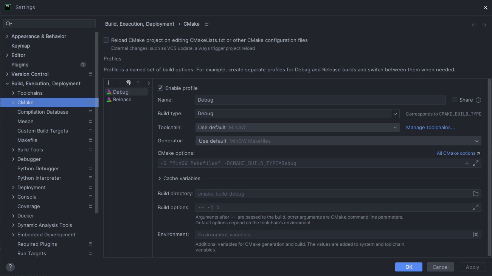
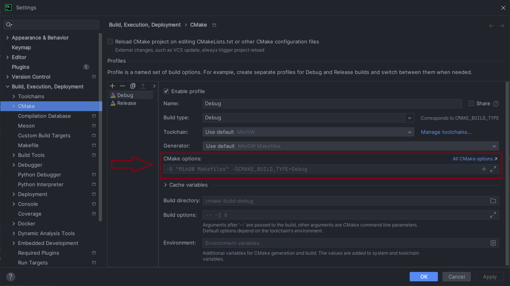

# Become A Dev Test Task

## Overview

This project implements a graph data structure to create a solve a puzzle.

### Functionality

* reading vertex data from a file
* creating a graph
* performing depth-first search (DFS) traversal
* validating puzzle combinations

## Table of Contents

#### - [Overview](#overview)

#### - [Project Requirements](#project-requirements)

#### - [Project Structure](#project-structure)

#### - [Program Pipeline](#program-pipeline)

#### - [`(Important)` Graph, DFS, Puzzle](#graph-dfs-puzzle)

#### - [Platforms](#platforms)

#### - [`(Important)` Building the Project](#building-the-project)

#### - [`(Important)` Running the Project](#running-the-project)

#### - [License](#license)

## Project Requirements

1. Read a text file passed by a user.
2. Output the longest puzzle combination where 2 last and 2 first digits are equal.

[Contents](#table-of-contents)

### Project Structure

- **BracedException/**: Contains the custom exception class used in the project.
- **ErrorCodeStrings/**: Contains error codes and their corresponding error messages.
- **FileReader/**: Contains functions for reading and processing data from files.
- **Graph/**: Contains the implementation of the Graph class.
- **Vertex/**: Contains the implementation of the Vertex class.
- **main.cpp**: The main entry point of the application.

[Contents](#table-of-contents)

### Program Pipeline

* Read text file to a list of integer arrays with 3 numbers.

* Convert them to a map for easier graph creation by last and first pairs of numbers.

* Filter numbers that can't form a combination.

* Create a graph, that is a vector of vertices.
    * Each vertex has edges - vector of pointers to other vertices

* Launch DFS.

* Check if any errors in the result path(in code I mainly call in this way) is valid.

[Contents](#table-of-contents)

### Graph, DFS, Puzzle

To explain how the project works, you would better see small illustrations and the console outputs.

```input.txt```:

```
345120
120345
789012
561234
901234
103456
341056
405678
345678
234789
```

##### 1. This file is read to a list of pointers to arrays, which contain 3 numbers each.

F.e.:

```
FFFFF -> 345120
|
V
00000 -> 120345
|
V
11111 -> 789012
|
V
... 
```

##### 2. We transform a list to a map which has negative and positive keys

Positive stand for elements that have edges, negative stand for elements that don't have edges, but they are connected
to at least one of the positive.
This is where we also filter unused 6-digit numbers.

F.e.:

```
34 -> 561234, 901234
|
V
-46 -> 120345
|
V
... 
```

##### 3. We create a graph of connected vertices

F.e. here is output for our ```input.txt```:

```
_____________

[345120]:
[120345]:
[789012]:
  ->120345
[561234]:
  ->345120
  ->341056
  ->345678
[901234]:
  ->345120
  ->341056
  ->345678
[103456]:
  ->561234
[341056]:
  ->561234
[405678]:
  ->789012
[345678]:
  ->789012
_____________
```

##### 4. We use DFS to find the longest combination, while caching the longest path for each vertex we visited.



_You can see how I generated frames for this GIF here: [graphVisualization](out/visualizeGraph.py)._

#### 5. We check in a cycle if the numbers are valid.

[Contents](#table-of-contents)

## Platforms

* **Windows**
* **Linux**
* **Mac**

This project uses **CMake** an open-source, cross-platform family of tools designed to build, test, and package
software. It is used to control the software compilation process using simple platform and compiler-independent
configuration files. CMake generates native makefiles and workspaces that can be used in the compiler environment of
your choice.

PS: I assume that if it works on Windows, it should work on other platforms. I'm sure about this, because I didn't use
any platform dependent libraries(fingers crossed 🤞).

[Contents](#table-of-contents)

## Building the Project

To build the project, you need to have a C++ compiler installed. You can use CMake to build the project.

1. Clone the repository:
    ```sh
    git clone <repository_url>
    cd BADTestTask
    ```

2. Create a build directory and navigate to it:
    ```sh
    mkdir build
    cd build
    ```

3. Run CMake to generate the build files:
    ```sh
    cmake ..
    ```

4. Build the project:
    ```sh
    cmake --build .
    ```
   #### PS: If you have following errors:





You should include this in your Cmake options in the command-line when you run the ```cmake ..``` command to generate
the build files:

 ```
 -DCMAKE_EXE_LINKER_FLAGS="-static" -DCMAKE_CXX_FLAGS="-static-libgcc -static-libstdc++"
 ```

Also you can add these options in your IDE, for example, in **CLion** you can do it this way:

* Open your **Build Types**



* Click **Edit CMake Profiles...**



* Paste the build options in **CMake Options field**:



* Press **Ok**

[Contents](#table-of-contents)

## Running the Project

After building the project, you can run the executable. By default, it reads data from `source.txt`. You can also
provide a different input file as a command-line argument.
And also you can output graph structure. It's very useful tool to test your graph.

* **Windows:**

```sh
test_task [input_file] [s]
```

* **Linux:**

```sh
./test_task [input_file] [s]
```

### Example

* To run the project with the default input file:

```sh
C:/path_to_executable> test_task 
```

* To run the project with a specific input file:

```sh
C:/path_to_executable> test_task custom_input.txt
```

* To show graph after reading:

```sh
C:/path_to_executable> test_task custom_input.txt s
```

[Contents](#table-of-contents)

## License

This project is licensed under the MIT License. See the [LICENSE](LICENSE.md) file for details.

[Contents](#table-of-contents)